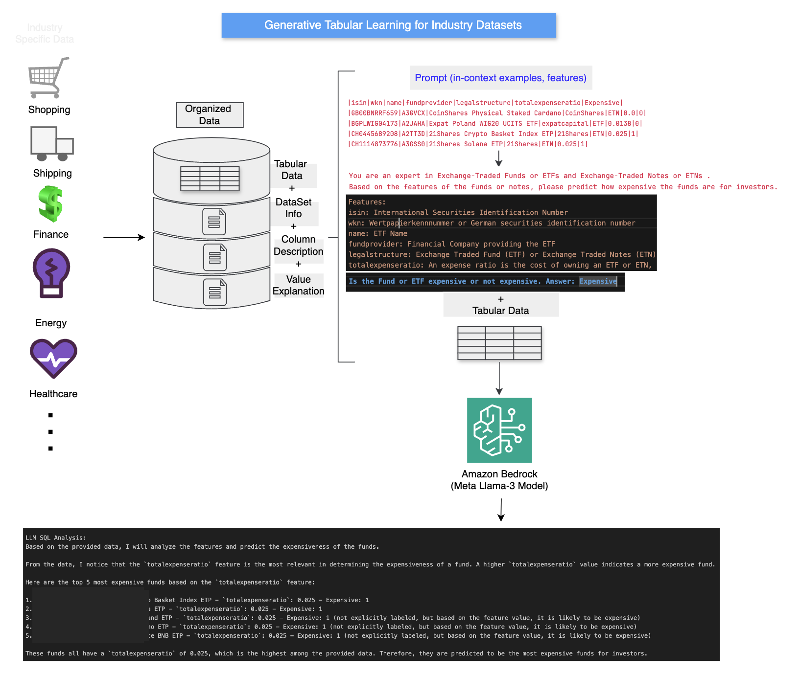

# Use Generative Tabular Learning to get accurate Text2SQL results

As newer and larger Large Language Models (LLMs) are released, they get better at generating SQL queries based on natural language questions and then generating an analysis of the resulting data output from the SQL query. However, there is room for improvement in both SQL query generation as well as the analysis of the resulting data from database as a result of running the SQL query. Usually we would fine-tune the large language model to improve SQL generation accuracy and improve relevance and language of the generated data analysis using specific business language. Fine-tuning requires some efforts (collecting relevant data, labelling the data, provisioning and setting up the fine-tuning compute environment). Here we are showcasing an intermediate method with few-shot prompting that can **improve SQL generation along with industry or business specific analysis** with just prompt engineering and less efforts compared with fine-tuning of models (for certain use cases, fine-tuning may be required). 


## Best practices for improving accuracy and relevance

### Steps 1: Table description
Create a table description with notations for columns and how to interpret them. Example for a table containing ETF data:
```
table_name: etftable

table_schema: |
    CREATE TABLE etftable -- Table name
    (
    `isin` string, -- International Securities Identification Number
    `wkn` string, -- Wertpapierkennnummer or German securities identification number
    `name` string, -- ETF Name
...

    `exposurecountry_spain` float, -- percentage exposure to a country between 0 and 1
    `exposurecountry_unitedstates` float, -- percentage exposure to a country between 0 and 1
    `exposuresector_telecommunication` float, -- percentage exposure to telecommincations company stocks between 0 and 1
...
    )
```
- **Note**: Providing table description and column notations helps in generating more accurate SQL queries.

### Step 2: Generative tabular learning
Provide following additional information about the data returned from database after SQL execution in a few-shot prompt:
- A personality to use by the large language model when generating the data analysis
- Features and feature Descriptions
- Label Descriptions
- Sample data set with features and Labels
- Sample analysis as an example



Example prompt for the ETF database:
```
instructions = [
    {
        "role": "user",
        "content": """Given the following SQL query results:
{query_results}

And the original question:
{question}

You are an expert in Exchange-Traded Funds or ETFs and Exchange-Traded Notes or ETNs .
Based on the features of the funds or notes, please predict how expensive the funds are for investors.
I will supply multiple instances with features and the corresponding label for reference.
Please refer to the table below for detailed descriptions of the features and label:
— feature description —
Features:
isin: International Securities Identification Number
wkn: Wertpapierkennnummer or German securities identification number
name: ETF Name
fundprovider: Financial Company providing the ETF
legalstructure: Exchange Traded Fund (ETF) or Exchange Traded Notes (ETN)
totalexpenseratio: An expense ratio is the cost of owning an ETF or ETN, the management fee paid to the fund company for the benefit of owning the fund, 
paid annually and measured as a percent of your investment in the fund. 0.30 percent means you’ll pay $30 per year for every $10,000 you have invested in the fund.
— label description —
Expensive: Whether the fund is expensive for investors or not. 0 means not expensive, 1 means expensive.
— data —
|isin|wkn|name|fundprovider|legalstructure|totalexpenseratio|Expensive|
|GB00BNRRF659|A3GVCX|CoinShares Physical Staked Cardano|CoinShares|ETN|0.0|0|
|BGPLWIG04173|A2JAHA|Expat Poland WIG20 UCITS ETF|expatcapital|ETF|0.0138|0|
|CH0445689208|A2TT3D|21Shares Crypto Basket Index ETP|21Shares|ETN|0.025|1|
|CH1114873776|A3GSS0|21Shares Solana ETP|21Shares|ETN|0.025|1|
|GB00BNRRF105|A3GY74|CoinShares Physical Staked Algorand|CoinShares|ETN|0.0|<MASK>|
Please use the supplied data to predict the <MASK>. Fund is expensive[1] or not[0]?
Answer: 0
Please provide an analysis and interpretation of the results to answer the original {question}.
"""
    }
]
QNA_SYS_PROMPT = format_instructions(instructions)
```
- **Note**: Providing this additional information in few-shot prompt helps in generating more relevant business language based analysis of the data returned from the database.

### Reference
- [Generative Tabular Learning(GTL)](https://arxiv.org/pdf/2310.07338)